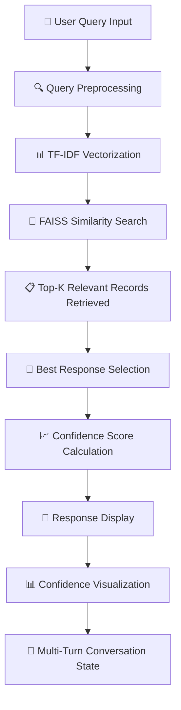

<div align="center">

# 🤖 Smart Chatbot with RAG

# Retrieval-Augmented Generation Conversational AI System

## Retrieve. Respond. Retain. Smarter Conversations. 🧠

</div>

---

<p align="center">


</p>

---

# 📖 Project Description

The **Smart Chatbot with Conversational RAG (Retrieval-Augmented Generation)** is a Python-based intelligent chatbot application that delivers accurate, dataset-grounded responses using information retrieval techniques. Built with a focus on multi-turn conversations, this system retrieves the most relevant responses from a curated dataset instead of generating random text, ensuring reliability, transparency, and consistency in answers.

This chatbot is designed for applications such as customer support, FAQs, information systems, and domain-specific assistants where factual correctness and confidence scoring are critical.

---

# ✨ Key Highlights

- 🤖 Conversational RAG Architecture
- 📊 TF-IDF + FAISS Powered Retrieval
- 🎯 Confidence Score Calculation
- 💬 Multi-Turn Conversation Handling
- 📈 Confidence Visualization
- 🧠 Dataset-Grounded Responses
- 🔍 Explainable AI Behavior
- 🎨 Interactive Streamlit Interface
- 📁 Evaluation Summary Included
- ⚡ Lightweight & Fast Execution

---

# 🏗 System Architecture

The Smart Chatbot follows a modular Retrieval-Augmented Generation pipeline that transforms user queries into dataset-grounded responses through TF-IDF vectorization, FAISS similarity search, and confidence scoring.



---

### 🔄 Application Workflow

1. User enters a query through the Streamlit chat interface.
2. Input text is cleaned and normalized using regular expressions.
3. Query is converted into a TF-IDF vector.
4. FAISS performs similarity search on the vector index.
5. Top-K most relevant records are retrieved from the dataset.
6. Best matching response is selected.
7. Confidence score is calculated from similarity distance.
8. Response and confidence are displayed to the user.
9. Conversation state is maintained for multi-turn interaction.
10. Ending keywords gracefully terminate the conversation.

---

# 📊 Feature Comparison

| Feature | Generative Chatbot | RAG Chatbot |
|:---|:---:|:---:|
| Factual Accuracy | ❌ Prone to Hallucination | ✅ Dataset-Grounded |
| Explainability | ❌ Black Box | ✅ Transparent |
| Confidence Scoring | ❌ | ✅ |
| Multi-Turn Support | ✅ | ✅ |
| Hallucination Risk | High | ✅ Low/None |
| Domain-Specific | ❌ | ✅ |
| Lightweight | ❌ | ✅ |
| Response Consistency | ❌ | ✅ |

---

# ✨ Core Features

## 🤖 Retrieval-Augmented Generation
- Dataset-grounded responses
- No hallucination
- Factually accurate answers
- Transparent retrieval process

---

## 📊 TF-IDF + FAISS Retrieval

| Component | Function |
|:---|:---|
| TF-IDF Vectorizer | Converts text to numerical vectors |
| FAISS Index | Enables fast similarity search |
| Cosine Similarity | Measures query-document similarity |
| Top-K Retrieval | Returns most relevant responses |

---

## 🎯 Confidence Score Calculation
- Similarity distance measurement
- Percentage-based confidence
- Visual confidence indicator
- Transparent scoring logic

---

## 💬 Multi-Turn Conversation
- Session-based chat history
- Context-aware responses
- Persistent conversation state
- Graceful conversation ending

---

## 🧠 Dataset-Grounded Responses
- Curated dataset of Q&A pairs
- Structured response retrieval
- Domain-specific knowledge
- Easy dataset expansion

---

## 📈 Confidence Visualization
- Visual confidence bars
- Color-coded indicators
- Real-time confidence display
- User-friendly interpretation

---

## 🎨 Interactive Interface
- Streamlit-powered chat UI
- Real-time message updates
- Clean and professional design
- User-friendly experience

---

# 🛠 Technology Stack

| Layer | Technology |
|:---|:---|
| Programming Language | Python 3.11 |
| User Interface | Streamlit |
| Vectorization | Scikit-Learn (TF-IDF) |
| Similarity Search | FAISS |
| Data Processing | Pandas + NumPy |
| Serialization | Pickle |
| Text Preprocessing | Regular Expressions (re) |
| Deployment | Streamlit Cloud / Local |
| Version Control | Git & GitHub |

---

# 📂 Project Structure

```text
SMART-CHATBOT-WITH-RAG/
│
├── app.py                              # Main Streamlit Application
├── build_vectorstore.py                # Vector Store Builder
├── clean_dataset.py                    # Data Cleaning Script
├── requirements.txt                    # Dependencies
├── README.md                           # Documentation
├── .gitignore                          # Git Ignore
│
├── data/
│   ├── rag.csv                         # Raw Dataset
│   └── rag_cleaned.csv                 # Cleaned Dataset
│
├── vectorstore/
│   ├── tfidf_vectorizer.pkl            # TF-IDF Vectorizer
│   └── tfidf.index                     # FAISS Index
│
├── notebooks/
│   ├── clean_dataset-checkpoint.py
│   ├── evaluate_rag.ipynb              # RAG Evaluation
│   └── inspect.ipynb                   # Data Inspection
│
├── evaluate_rag.ipynb                  # Evaluation Notebook
└── inspect.ipynb                       # Inspection Notebook
```

---

# 📸 Application Preview


The screenshots above demonstrate the Smart Chatbot's complete workflow—from user query input and TF-IDF vectorization to FAISS similarity search, confidence scoring, and multi-turn conversation management.


---

# ⚙ Installation

## Prerequisites

- Python 3.11+
- pip

---

### Clone Repository

```bash
git clone https://github.com/Keya3639/SMART-CHATBOT-WITH-RAG.git

cd SMART-CHATBOT-WITH-RAG
```

---

### Install Dependencies

```bash
pip install -r requirements.txt
```

---

### Build Vector Store

```bash
python build_vectorstore.py
```

---

### Run Application

```bash
streamlit run app.py
```

---

### Alternative Execution

```bash
python app.py
```

---

# 🚀 Demo Workflow

| Step | Action |
|:--:|:---|
| 1 | Open Streamlit Chat Interface |
| 2 | Type Your Query or Question |
| 3 | System Preprocesses Query |
| 4 | TF-IDF Vectorization |
| 5 | FAISS Similarity Search |
| 6 | Top-K Records Retrieved |
| 7 | Best Response Selected |
| 8 | Confidence Score Calculated |
| 9 | Response Displayed with Confidence |
| 10 | Continue Multi-Turn Conversation |

---

# 🌟 Why RAG Chatbot?

Unlike purely generative models that can hallucinate, the **Smart Chatbot with RAG** grounds every response in a curated dataset, ensuring factual correctness, transparency, and reliability.

This system helps:

- 🤖 Build trustworthy conversational AI
- 📊 Ensure factual accuracy
- 🎯 Provide confidence scores
- 💬 Support multi-turn conversations
- 🔍 Enable explainable AI behavior
- ⚡ Deliver fast, lightweight responses

**RAG Chatbot doesn't generate answers—it retrieves the right ones.**

---

# 📈 Advantages

- ✅ High accuracy and consistency
- ✅ Explainable AI behavior
- ✅ No hallucinations, ensuring trustworthy responses
- ✅ Lightweight and fast
- ✅ Easily extensible with dataset updates
- ✅ User-friendly interface
- ✅ Suitable for domain-specific applications

---

# ⚠️ Limitations

- Limited to dataset knowledge
- Cannot answer unseen or out-of-scope queries
- TF-IDF lacks deep semantic understanding
- Manual dataset updates required for new domains
- Not a generative model for creative responses

---

# 🌟 Real-Time Applications

- 💬 Customer Support Chatbots for FAQs and policies
- 🎓 Educational Assistants for syllabus-based Q&A
- 🏢 Enterprise Knowledge Systems for documentation
- 🛍️ E-commerce Help Bots for order tracking
- 🏥 Domain-Specific Chatbots for healthcare, banking

---

# 🔮 Future Enhancements

| Phase | Features |
|:---|:---|
| Phase 1 | Sentence-BERT or transformer embeddings |
| Phase 2 | Hybrid RAG with LLM generation |
| Phase 3 | Voice-enabled chatbot support |
| Phase 4 | Multilingual dataset support |
| Phase 5 | Admin dashboard for dataset management |
| Phase 6 | Advanced evaluation metrics (MRR, Recall@K) |

---

# 🛣 Roadmap

- ✅ TF-IDF + FAISS Retrieval
- ✅ Confidence Score Calculation
- ✅ Multi-Turn Conversation
- ✅ Streamlit Interface
- ✅ Dataset-Grounded Responses
- 🔄 Transformer Embeddings
- 🔄 Hybrid RAG Architecture
- 🔄 Voice Integration

---

# 🎯 Conclusion

The **Smart Chatbot with Conversational RAG** showcases a practical and production-oriented approach to building explainable conversational AI systems. By combining TF-IDF, FAISS, and Streamlit, the project delivers fast, accurate, and transparent responses while avoiding the risks of hallucination.

This system serves as a strong foundation for real-world chatbot deployments and demonstrates solid understanding of modern NLP retrieval techniques.

---

# 👩‍💻 Developer

## Keya Das

**MCA (Artificial Intelligence & Data Science)**

🌐 **GitHub**

https://github.com/Keya3639

📧 **Email**

keyakarunamoydas@gmail.com

---

# 🙏 Acknowledgements

This project was developed using the following open-source technologies and frameworks:

- 🧠 Scikit-Learn
- 🔎 FAISS
- 🎨 Streamlit
- 🐍 Python
- 🐼 Pandas
- 📊 NumPy
- 💾 Pickle
- 🌍 Open Source Community

---

<div align="center">

# 🤖 Smart Chatbot with RAG

### Retrieve. Respond. Retain. Smarter Conversations. 🧠

<br>

**Built with ❤️ using**

**Python • Streamlit • FAISS • Scikit-Learn • Pandas • NumPy • Pickle**

<br>

</div>

